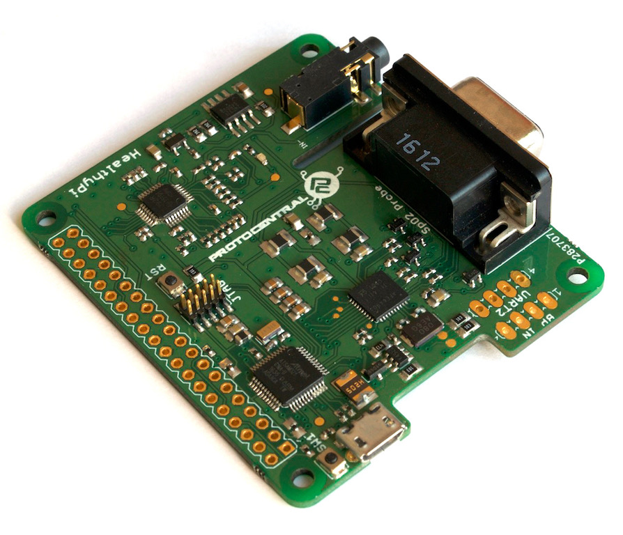
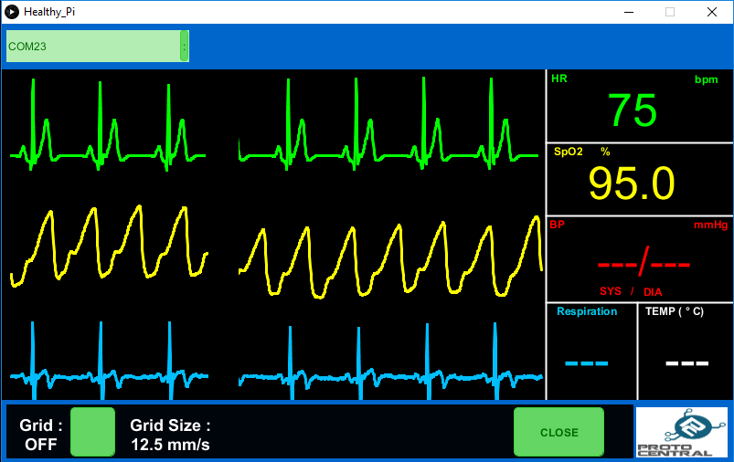

[](https://waffle.io/Protocentral/HealthyPi)
# ProtoCentral HealthyPi HAT for Raspberry Pi



This HAT for Raspberry Pi 3 / 2 includes vital patient monitoring including ECG, respiration, pulse oximetry and features options to add blood pressure and body temperature sensing.

This is a one-of-a-kind, all-in-one HAT for your Raspberry Pi 2 /3 computer. Just plug it into the Raspberry Pi, install the graphical visualisation software and start using. Unlike available shields and breakouts that we carry for Arduino, this board combines all the functions into a a single board.

###NEW

HealthyPi is no longer only for Raspberry Pi. All HealthyPi boards shipped on or after February 20, 2017 come **pre-installed with the Arduino Zero bootloader** and can be programmed with the Arduino IDE and used with any computer that supports Java. 

If you dont already have one, you can buy [HealthyPi at ProtoCentral](https://www.protocentral.com/healthypi)

Repository Contents
-------------------
* **/firmware** - Atmel studio  and aduino example sketches.
* **/Hardware** - All Eagle design files (.brd, .sch)
* **/extras** - includes the datasheet
* **/gui** - HealthyPi GUI for Raspberry Pi and PC
* **/docs** - Additional Documentation

Getting Started (On Raspberry Pi):
----------------------------------

Mount ProtoCentral's Healthy PI Hat carefully onto the Raspberry Pi Board's GPIO Pins. And connect this setup with the Raspberry Pi's Display or HDMI Monitor. The Hat communicate with Raspberry Pi using UART interface. Connect the ECG electrodes and SPO2 Probe to the ProtoCentral's Healthy PI Hat.

It's now easy to get started with our brand-new installation script. Just follow the following steps on your Raspberry Pi.

To start, open up the terminal window (Menu -> Accessories -> Terminal) on Raspbian running on your Raspberry Pi:


In the terminal window, type the following lines. 

```bash
curl -sS http://pi.protocentral.com/pi.sh | sudo bash
```

It really is as simple as that !!

This code will install all the required overlays, configuration and application files to get the Healthy Pi up and running.

After the script reboots, you should be able to see the GUI display on the screen



###This completes the install!

If the above script does not work for you and would like to do a manual installation or would like to customize the code, check out [Advanced HealthyPi] (/docs/advanced-healthypi.md).

Using the HealthyPi GUI on Windows, MacOS and Linux
---------------------------------------------------
The HealthyPi board now streams the same data on the on-board USB port. This allows you to get the same data that goes to the Raspberry Pi, now on your desktop PC as well. 

Java 8 is required on all platforms for running the processing-based GUI application. You can download Java for your platform from the following link.

[https://java.com/en/download/](https://java.com/en/download/)

#### Installing drivers (only for Windows)

HealthyPi uses the same drivers as an Arduino Zero. Once plugged in to the USB port, the device would be recognized as an "Unknown Device". You can locate the device is the Windows Device Manager and manually install the drivers provided in the "drivers" folder in the Windows Executable ZIP archive provided.

MacOS and Linux do not need any drivers to be installed.

### Processing GUI Installation

Download the zip file containing the executable files from the following links for 32-bit/64-bit Windows. If you do not know if you have a 64-bit or 32-bit computer, please download the 32-bit version.

* [Windows 32-bit Executable (ZIP)](https://github.com/Protocentral/HealthyPi/releases/download/v0.2/healthypi_gui_win32.zip)
* [Windows 64-bit Executable (ZIP)](https://github.com/Protocentral/HealthyPi/releases/download/v0.2/healthypi_gui_win64.zip)
* [MacOS Executable (ZIP)](https://github.com/Protocentral/HealthyPi/releases/download/v0.2/healthypi_gui_macos.zip)
* [Linux 32-bit Executable (ZIP)](https://github.com/Protocentral/HealthyPi/releases/download/v0.2/healthypi_gui_linux32.zip)
* [Linux 64-bit Executable (ZIP)](https://github.com/Protocentral/HealthyPi/releases/download/v0.2/healthypi_gui_linux64.zip)

Simply download the appropriate file for your operating system, unzip the contents and run the executable program contained in it. 

Programming the on-board SAMD21 microcontroller
--------------------------------------------------

HealthyPi now supports programming using Arduino ! 

If you wish to program your own code on the HealthyPi board, check out [Modifying and recompiling HealthyPi Firmware](/docs/recompiling-firmware.md).

Connecting the ECG Electrodes
------------------------------
 A 3-electrode cable along with a standard stereo jack is provided along with the shield to connect the electrodes to the  board. 
 The other side of the electrode connector would connect to snap-on electrodes attached to the body. For testing purposes,    you can use an ECG simulator to provide inputs to the board. 

 Warning:
 When connecting the electodes to the body, it is safer to disconnect the mains power source to the Arduino. For example, if  you are using the Arduino along with a laptop, disconnecting the battery charger from the laptop would be a safe option.
 
Placing the Electrodes on the body
---------------------------------


License Information
===================

This product is open source! Both, our hardware and software are open source and licensed under the following licenses:

Hardware
---------

**All hardware is released under [Creative Commons Share-alike 4.0 International](http://creativecommons.org/licenses/by-sa/4.0/).**


Software
--------

**All software is released under the MIT License(http://opensource.org/licenses/MIT).**

Please check [*LICENSE.md*](LICENSE.md) for detailed license descriptions.

THE SOFTWARE IS PROVIDED "AS IS", WITHOUT WARRANTY OF ANY KIND, EXPRESS OR
IMPLIED, INCLUDING BUT NOT LIMITED TO THE WARRANTIES OF MERCHANTABILITY,
FITNESS FOR A PARTICULAR PURPOSE AND NONINFRINGEMENT. IN NO EVENT SHALL THE
AUTHORS OR COPYRIGHT HOLDERS BE LIABLE FOR ANY CLAIM, DAMAGES OR OTHER
LIABILITY, WHETHER IN AN ACTION OF CONTRACT, TORT OR OTHERWISE, ARISING FROM,
OUT OF OR IN CONNECTION WITH THE SOFTWARE OR THE USE OR OTHER DEALINGS IN THE
SOFTWARE.
