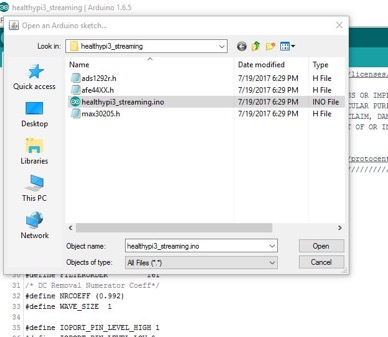

# Upgrading HealthyPi v3 Firmware

All HealthyPi v3 boards come **pre-installed** with the Arduino Zero bootloader and the current release Arduino-based code. This means that you no longer need a JTAG programmer or Atmel Studio or similar toolchain to customize the code on the SAMD21 microcontroller on the board.

In addition, the new Arduino-based HealthyPi v3 firmware now **streams over USB** the same data sent to the Raspberry Pi's UART pins. This now means that the HealthyPi works not just with a Raspberry Pi, but any Windows/MAC/Linux machine that supports Java and Processing.

To upgrade the firmware, simply following these steps to get started:

### Step 1: Install the Arduino IDE

Download and install the latest version of the Arduino IDE for your corresponding platform from the following Page.

[Arduino Downloads Page at https://www.arduino.cc/en/Main/Software](https://www.arduino.cc/en/Main/Software)

### Step 2: Install support for the Arduino Zero (Atmel SAMD21 MCU)

Plug in the HealthyPI to your PC through the USB cable provided and follow the instructions on Arduino website for getting started with the Arduino Zero. When connected to a computer, your HealthyPi will behave exactly like an Arduino Zero does.

[Install support for Arduino Zero](https://www.arduino.cc/en/Guide/ArduinoZero)

### Step 3: Open the HealthyPi code in Arduino

Download the latest code from the releases section of the HealthyPi v3 Github repository at https://github.com/Protocentral/protocentral-healthypi-v3/releases

From this page, download the "healthypi-firmware.zip" file under the **latest available release**.

Once downloaded, unzip the file and in Arduino open the ".ino" file from the unzipped folder.

### Step 4: Upload the program

Click the "Upload" button on the Arduino IDE to compile and upload the firmware.

If all goes well, you should see an "Done Uploading" or similar message.

### Step 5: Start hacking

Feel to hack away at the code and try out things. Submit an issue on our Github site (https://github.com/Protocentral/protocentral-healthypi-v3/issues) if you think you've run into a bug or if there's something you'd like to see added.
